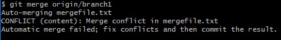

# Отчет по лабораторной работе №6
## Система контроля версий Git
## Цель: изучение базовых возможностей системы управления версиями, опыт работы с Git Api, опыт работы с локальным и удаленным репозиторием. 

---

## Ход работы:
1. Создан аккаунт GitHub
    
    

2. Сделан форк репозитория

    

3. Установлен гит

    

4. Настроен гит клиент

    

5. Клонирован гит репозиторий локально

    

6. Добавлен файл через интерфейс гита и подтянуты изменения в локальный репозиторий

    

    

---

7. Получена история операций
   
   

8. Просмотрены последние изменения

   

9. Выполнено слияние веток

   

   Попытка слияния выдает конфликт

   

   Проблема решена

10. Удалена побочная ветка
   
    

11. Сделаны несколько изменений

    

12. Произведен откат коммита

    

13. Создана ветка для отчета

    

---

15. Получена история операция в форматированном виде

    

---

## Вывод
В ходе работы изучены базовые команды Git и работа с удалёнными репозиториями.
